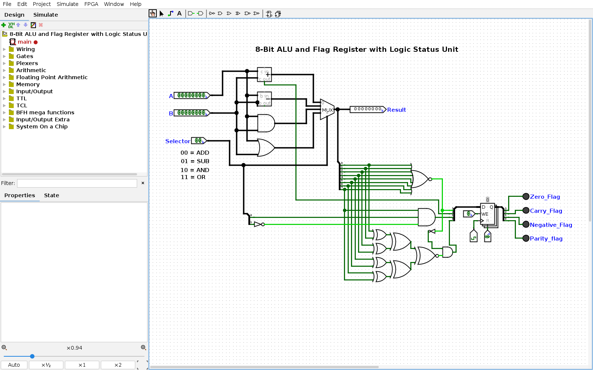

# 🧮 8-Bit ALU & Flag Register

<strong>Logisim Evolution • Digital Logic • Computer Architecture</strong> <em>An 8-bit ALU designed and simulated from fundamental digital-logic building blocks.</em>

## 🖥️ Live circuit preview

The screenshot is generated automatically from the current Logisim Evolution circuit by GitHub Actions.

> 💡 A compact demonstration of arithmetic, bitwise operations, control selection and processor-style status flags.

## 👋 What is inside?
The circuit accepts two 8-bit operands, selects one of four operations and exposes the result through a 4-bit status/flag register.

## ⚡ Operations
| Selector | Operation | Logic |
|---|---|---|
| 00 | ADD | A + B |
| 01 | SUB | A − B |
| 10 | AND | A AND B |
| 11 | OR | A OR B |

## 🔌 Inputs
- **A** — 8-bit operand
- **B** — 8-bit operand
- **Selector** — 2-bit operation control

## 🚦 Status Flags
| Flag | Meaning |
|---|---|
| 🟢 Zero | Result equals 0 |
| 🔄 Carry | Arithmetic carry / borrow-related status |
| 🔴 Negative | Result MSB is set |
| 🟣 Parity | Result parity status |

## 🧪 Example tests
| A | B | Operation | Expected |
|---:|---:|---|---:|
| 5 | 3 | ADD | 8 |
| 8 | 3 | SUB | 5 |
| 170 | 240 | AND | 160 |
| 170 | 15 | OR | 175 |

## 🛠️ Tool
Built and simulated with **Logisim Evolution**.

Open **8-Bit ALU and Flag Register with Logic Status Unit.circ**.

## 🎓 What this demonstrates
Combinational digital logic · ALU architecture · Arithmetic and bitwise operations · Multiplexer/control selection · Status-flag generation · Circuit simulation · Computer architecture

## 🔮 Future improvements
Labeled circuit views · Test/demo GIF · Exact flag truth tables · Increment/decrement · Expanded arithmetic functions

## 🌐 Connect
🌐 [Portfolio](https://ragibashhab.netlify.app/) · 💼 [LinkedIn](https://www.linkedin.com/in/md-ragib-ashhab-768a19240/) · 🔗 [Linktree](https://linktr.ee/RagibAshhab) · 🐙 [GitHub](https://github.com/TheKIAR)

---

Built by Md. Ragib Ashhab • Digital Logic & Computer Architecture
